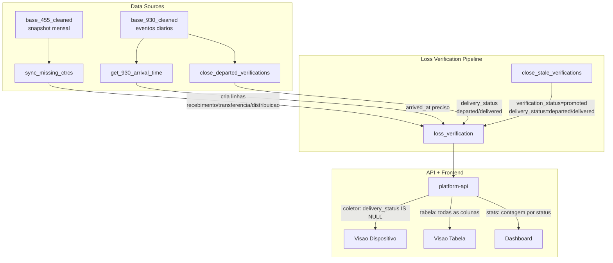
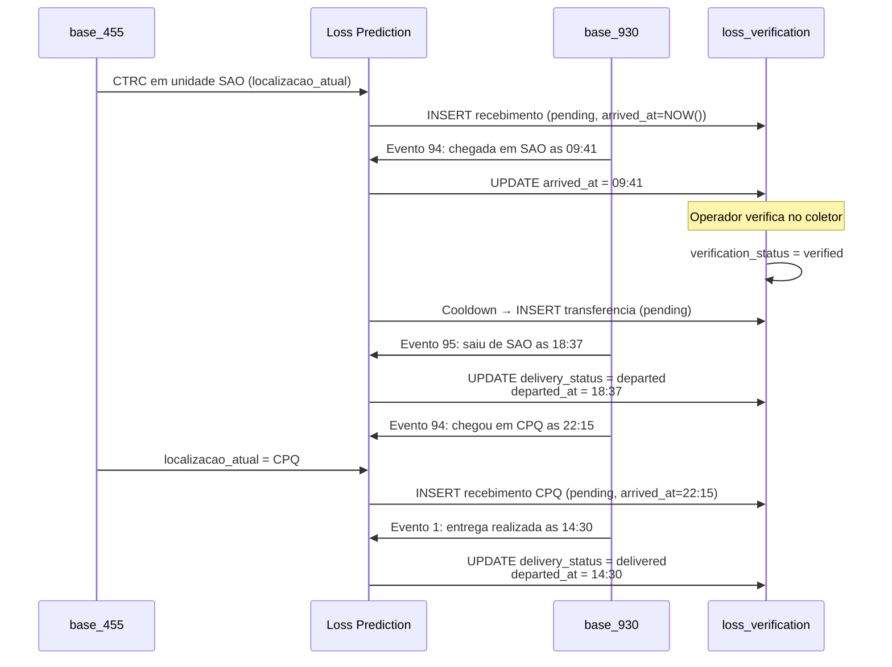
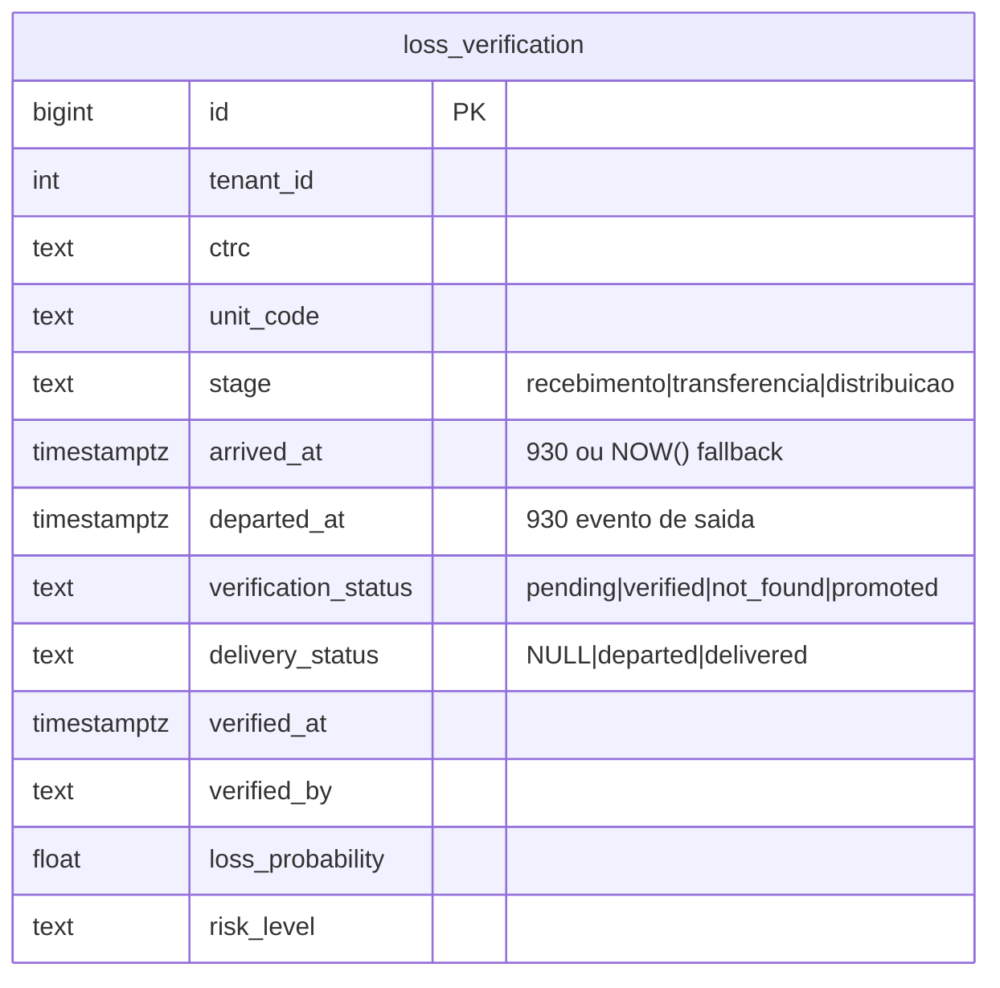

# 0001 — Detecção de saída de carga via 930 + separação delivery_status

**Data**: 2026-03-24
**Atualizado**: 2026-03-24
**Status**: Implementado e deployado. Validado parcialmente.
**Repos afetados**: `laplace-data-warehouse`, `laplace-service-loss-prediction`, `laplace-platform-api`, `laplace-platform`
**Issues**:
- [laplace-service-loss-prediction#4](https://github.com/laplace-ai/laplace-service-loss-prediction/issues/4)
- [laplace-data-warehouse#11](https://github.com/laplace-ai/laplace-data-warehouse/issues/11)
- [laplace-service-loss-prediction#2](https://github.com/laplace-ai/laplace-service-loss-prediction/issues/2)

---

## 1. Problema

Cards antigos permaneciam no coletor (visao em dispositivo) mesmo quando a carga ja havia saido da unidade ou sido entregue. Exemplos: CTRCs de 18/03 ainda apareciam como pendentes em transferencia/distribuicao em 24/03 — 6 dias parados.

Tres causas raiz foram identificadas:

### Causa 1: `is_delivered` incompleto na base_455

A coluna `is_delivered` verificava apenas `localizacao_atual == 'CTRC ENTREGUE/BAIXADO'`. Porem, muitos CTRCs tinham `localizacao_atual` mostrando a ultima unidade enquanto `descricao_da_ultima_ocorrencia` ja dizia "ENTREGA REGISTRADA VIA MOBILE".

- **5.088 CTRCs** tinham `is_delivered = false` mas descricao de entrega registrada
- Exemplo: `BAR322280-2` — 930 mostrava entrega em 19/03, `is_delivered = false` na 455

### Causa 2: ausencia de deteccao de saida da unidade

O `close_stale_verifications()` dependia exclusivamente da 455 para detectar movimentacao. A 455 e um snapshot mensal — se a carga saiu da unidade mas a 455 ainda nao atualizou, o card permanecia indefinidamente.

A base_930 (log de eventos do TMS, snapshot diario) tinha os eventos exatos de saida com timestamps precisos, mas nao era utilizada.

### Causa 3: `arrived_at` impreciso

O `arrived_at` era setado como `NOW()` no momento do sync, nao refletindo o horario real de chegada da carga na unidade. Para CTRCs do primeiro dia de operacao (18/03), todos tinham o mesmo horario.

---

## 2. Investigacao

### 2.1 Eventos da base_930

```
Eventos de saida:
  cod_ocor 87 = SAIDA P/ ENTREGA         (~51.000/mes)
  cod_ocor 95 = SAIDA DA UNIDADE          (~24.000/mes)

Eventos de chegada:
  cod_ocor 93 = CHEGADA NA UNIDADE DE DESTINO  (~9.500/mes)
  cod_ocor 94 = CHEGADA NA UNIDADE             (~5.400/mes)

Eventos de entrega:
  cod_ocor  1 = ENTREGA REALIZADA NORMALMENTE  (~136.000/mes)
  cod_ocor 11 = ENTREGA REGISTRADA VIA MOBILE  (~86.000/mes)
```

### 2.2 Taxa de retorno

- Total de saidas: ~51.000
- Total de retornos (insucesso + retorno): ~1.700
- **Taxa de retorno: ~3.3%**
- Decisao: ignorar retornos. Se saiu, considera-se que saiu.

### 2.3 Cobertura da 930

A 930 so tem dados com volume significativo a partir de 06/03/2026 (ultimos ~18 dias).
Eventos anteriores sao residuais (1-200/dia). Para CTRCs antigos, nao ha historico disponivel.

### 2.4 Dados pos-investigacao

| Metrica | Valor |
|---------|-------|
| CTRCs com `is_delivered` corrigido | 5.088 |
| CTRCs com `arrived_at` corrigido via 930 | ~6.912 |
| CTRCs marcados `departed` via 930 | ~450 |
| CTRCs marcados `delivered` via 930 + 455 | ~5.114 |
| CTRCs genuinamente em unidade | ~10.151 |
| CTRCs sem dados na 930 (antigos) | ~6.196 |

---

## 3. Decisoes

### 3.1 Fix do `is_delivered` (Data Warehouse)

Expandir logica para verificar `descricao_da_ultima_ocorrencia` com padroes de entrega, alem de `localizacao_atual`.

### 3.2 Usar 930 para deteccao de saida (Loss Prediction)

Nova funcao `close_departed_verifications()` que cruza `loss_verification` com `base_930_cleaned` para detectar saidas e entregas.

### 3.3 Usar 930 para `arrived_at` preciso

Quando disponivel, usar timestamp do evento de chegada (93/94) da 930. Fallback para `NOW()` se a 930 nao tiver o evento ainda.

### 3.4 Separar `delivery_status` de `verification_status`

**Decisao arquitetural mais importante.** Inicialmente, saidas eram marcadas como `verification_status = 'departed'`. Problema: isso sobrescrevia o historico de verificacao (um CTRC que foi verificado perdia esse registro ao ser marcado como departed).

**Solucao**: criar coluna separada `delivery_status` que rastreia o deslocamento da carga independentemente da verificacao.

```
verification_status = pending | verified | not_found | promoted
                      (nunca sobrescrito por saida/entrega)

delivery_status     = NULL (em unidade) | departed | delivered
                      (rastreia movimento da carga)

departed_at         = timestamp de quando saiu/foi entregue
```

### 3.5 Fontes de dados por responsabilidade

```
455 = ONDE esta (localizacao_atual_code)
930 = QUANDO chegou/saiu (timestamps precisos)
```

---

## 4. Arquitetura

### 4.1 Fluxo de dados



### 4.2 Ciclo de vida de um CTRC na loss_verification



### 4.3 Colunas da loss_verification (relevantes)



---

## 5. Alteracoes por repositorio

### 5.1 laplace-data-warehouse

**Branch**: `fix/is-delivered-logic` → merged to `main`

**`src/pipelines/base_455/pipeline.py`**
- Adicionado passo pos-COPY que verifica `descricao_da_ultima_ocorrencia` com padroes:
  `ENTREGA REALIZADA%`, `ENTREGA REGISTRADA%`, `ENTREGA EFETUADA%`
- Se match, atualiza `is_delivered = true`

**Migration**: `scripts/sql/fix-is-delivered-from-description.sql`
- Backfill: corrigiu 5.088 CTRCs

### 5.2 laplace-service-loss-prediction

**Branches**: `feat/930-departure-detection` + `refactor/delivery-status-column` → merged to `main`

**`src/verification.py`**

| Funcao | Mudanca |
|--------|---------|
| `close_departed_verifications()` | Seta `delivery_status` (departed/delivered) em vez de `verification_status`. Duas queries: primeiro marca entregas (cod 1,11), depois saidas (cod 87,95). Filtro por timestamp completo. |
| `close_stale_verifications()` | Agora tambem seta `delivery_status` via CASE: `is_delivered=true` → delivered, location changed → departed |
| `get_930_arrival_time()` | Busca evento de chegada (93/94) na 930. Retorna timestamp ou None. |
| `sync_missing_ctrcs()` | Usa `arrived_at` da 930 com fallback para `NOW()` |

**Migrations executadas**:

| Script | Resultado |
|--------|-----------|
| `add-departed-status.sql` | Adicionou coluna `departed_at`, constraint com `departed` |
| `backfill-930-arrival-departure.sql` | Corrigiu `arrived_at` (~6.912), preencheu `departed_at` (~7.245) |
| `add-delivery-status.sql` | Adicionou `delivery_status`, migrou 451 rows de `verification_status=departed`, removeu `departed` do constraint de verification_status |

### 5.3 laplace-platform-api

**Branches**: `feat/930-departure-detection` + `refactor/delivery-status-column` → merged to `master`

| Arquivo | Mudanca |
|---------|---------|
| `loss_verification.py` | `delivery_status` em ALLOWED_FIELDS, DEFAULT_FIELDS, novo filtro de query |
| `loss_verification_stats.py` | Stats contam por `delivery_status` (departed/delivered) em vez de `verification_status` |
| `v1_loss_verification.py` | Novo query param `delivery_status`, validacao com VALID_DELIVERY_STATUSES |

### 5.4 laplace-platform (frontend)

**Branch**: `refactor/delivery-status-column` → merged to `develop`

| Arquivo | Mudanca |
|---------|---------|
| `loss-prediction-table.tsx` | Nova coluna "Situacao" com tags: Em unidade (null), Em deslocamento (departed), Entregue (delivered). Filtros de verification_status atualizados (removido departed, adicionado promoted) |
| `database-browser.tsx` | Mesma coluna delivery_status no database browser |
| `lib/api.ts` | Interface atualizada com `delivery_status` e `departed_at` |
| `messages/pt-BR.json` | Translation: `columnDeliveryStatus: "SITUACAO"` |

---

## 6. Bugs encontrados e corrigidos durante implementacao

### 6.1 `IN :param` com pg8000

O driver pg8000 nao suporta passar tupla Python para `IN :param` via `text()` do SQLAlchemy. Causou 500 em todas as requests por 2+ horas.
**Fix**: trocar para f-string com codigos expandidos (mesmo padrao do `close_departed_verifications()`).

### 6.2 Filtro por date vs timestamp

O filtro `b.data_ocor >= lv.arrived_at::date` permitia pegar eventos de saida anteriores a chegada no mesmo dia (ex: saida as 04:39, chegada as 23:24 — carga que voltou). Resultou em 755 rows com `departed_at < arrived_at`.
**Fix**: trocar para `(b.data_ocor + b.hora_ocor::time) >= lv.arrived_at` (timestamp completo).

### 6.3 `hora_ocor` varchar vs time

Coluna `hora_ocor` na 930 e `varchar`, nao `time`. COALESCE falhava por type mismatch.
**Fix**: cast explicito `COALESCE(b.hora_ocor::time, '00:00:00'::time)`.

---

## 7. Estado atual

### Dados na loss_verification (tenant_id=1, 2026-03-24):

| delivery_status | Quantidade | Significado |
|----------------|-----------|-------------|
| NULL (em unidade) | 10.151 | Carga genuinamente na unidade |
| departed | 4.519 | Carga saiu da unidade |
| delivered | 5.114 | Carga entregue |

### Limitacoes conhecidas

1. **`arrived_at` impreciso para CTRCs antigos**: CTRCs do primeiro dia de operacao (18/03) tem `arrived_at = NOW()` pois a 930 nao tem historico. Corrigivel via backfill da 930 (issue [data-warehouse#13](https://github.com/laplace-ai/laplace-data-warehouse/issues/13)).

2. **Cobertura da 930**: dados com volume so a partir de ~06/03/2026. CTRCs anteriores dependem exclusivamente da 455 para deteccao de entrega/saida.

3. **CTRCs genuinamente parados**: ~9.500 CTRCs com `delivery_status IS NULL` e `localizacao_atual_code = unit_code`. Investigacao mostrou que sao cargas retidas (aguardando devolucao, processo arquivado, agendamento, debito, etc.). Nao sao bugs.

---

## 8. Evolucao futura

- **Backfill historico da 930** ([data-warehouse#13](https://github.com/laplace-ai/laplace-data-warehouse/issues/13)): carregar snapshots antigos para corrigir `arrived_at` e capturar saidas historicas
- **Expandir retencao da 930** ([data-warehouse#15](https://github.com/laplace-ai/laplace-data-warehouse/issues/15)): manter 6-12 meses de eventos
- **`promoted_at`**: adicionar timestamp de quando o CTRC foi promovido de etapa
- **Deteccao de chegada via 930**: migrar deteccao de "em qual unidade esta" da 455 para 930 (elimina latencia do snapshot mensal)
- **Tipos de CTRC configuraveis**: transformar filtro `NORMAL` em parametro para aceitar outros tipos
